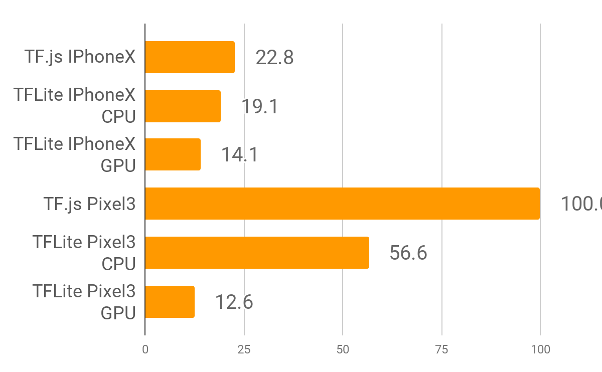
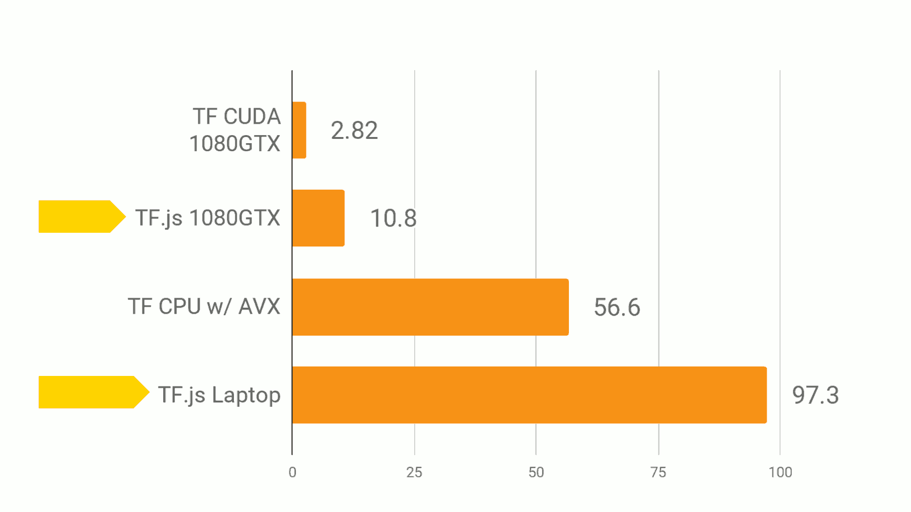
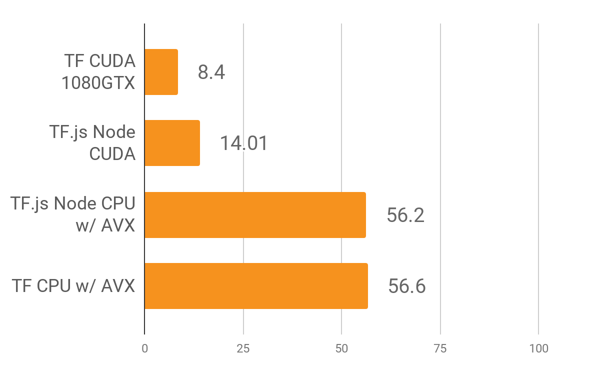

## 性能

Tensorflow.js的性能如何，Google官方做了一份基于MobileNet的评测，可以作为参考。具体评测是基于MobileNet的Tensorflow模型，将其JavaScript版本和Python版本各运行两百次。

其评测结论如下。

### 手机浏览器性能

Tensorflow.js在手机浏览器中运行一次推理：

1. 在 IPhoneX 上需要时间为 22 ms
1. 在 Pixel3 上需要时间为 100 ms

与 Tensorflow Lite 代码基准相比，手机浏览器中的 Tensorflow.js 在 IPhoneX 上的运行时间为基准的1.2倍，在 Pixel3 上运行的时间为基准的 1.8 倍。

### 台式机浏览器性能

在浏览器中，Tensorflow.js可以使用WebGL进行硬件加速，将GPU资源使用起来。

Tensorflow.js在浏览器中运行一次推理：

1. 在CPU上需要时间为97.3ms
1. 在GPU(WebGL)上需要时间为10.8ms

与Python代码基准相比，浏览器中的Tensorflow.js在CPU上的运行时间为基准的1.7倍，在GPU(WebGL)上运行的时间为基准的3.8倍。

### Node.js性能

在 Node.js 中，Tensorflow.js 使用 Tensorflow 的 C Binding ，所以基本上可以达到和 Python 接近的效果。

Tensorflow.js 在 Node.js 运行一次推理：

1. 在 CPU 上需要时间为56ms
1. 在 GPU(CUDA) 上需要时间为14ms

与 Python 代码基准相比，Node.js 的 Tensorflow.js 在 CPU 上的运行时间与基准相同，在 GPU（CUDA） 上运行的时间是基准的1.6倍。
